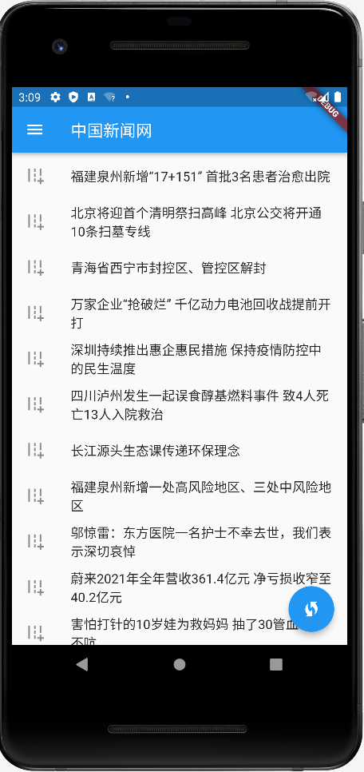
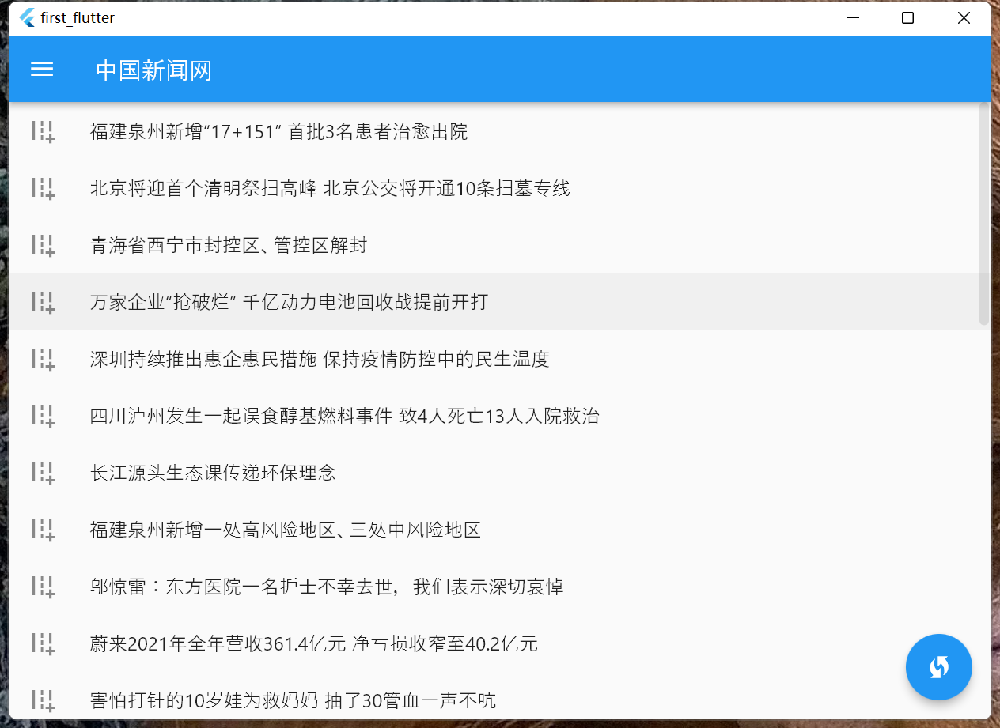

# first_flutter

My fist Flutter learn demo.

## Getting Started

This project is a starting point for a Flutter application.

### build step

- Clone Repo

~~~bash
git clone https://github.com/tufeiping/first-flutter-demo.git
~~~

- cd first-flutter-demo

- pull dependencies

~~~bash
flutter pub get
~~~

- debug run in chrome

~~~bash
flutter run -d chrome
~~~

- build target apk or windows

~~~bash
flutter build apk

flutter build windows
~~~

### snapshot for mobile

### snapshot for windows

A few resources to get you started if this is your first Flutter project:

- [Lab: Write your first Flutter app](https://flutter.dev/docs/get-started/codelab)
- [Cookbook: Useful Flutter samples](https://flutter.dev/docs/cookbook)

For help getting started with Flutter, view our
[online documentation](https://flutter.dev/docs), which offers tutorials,
samples, guidance on mobile development, and a full API reference.
